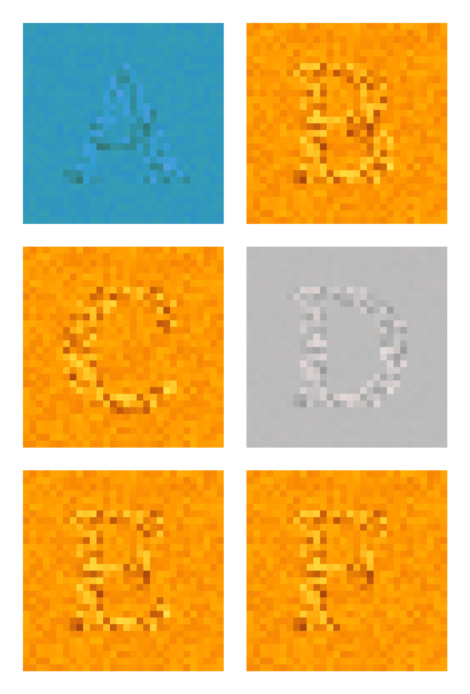

# Colory

This is a small project to generate some prints out of my son name for his room. It is still a work in process.

The idea was to use a second canvas and `OffScreenCanvas` (only works in Chrome) to generate some mask, and then use it as an input in the second phase when generating the image. So far it is only used to change some parameters of the HSL color space. But I want to explore other possibilities.

The final piece is generated as a matrix (first try just filling the boxes) and the mask is a canvas which the size in pixels is the same as the number of points in the final draw. So a pixel in the mask, corresponds to a box in the final piece.

The `test.js` is used to play with what could be a mask.

Everything uses [canvas-sketch](https://github.com/mattdesl/canvas-sketch) so you need to have that installed.

